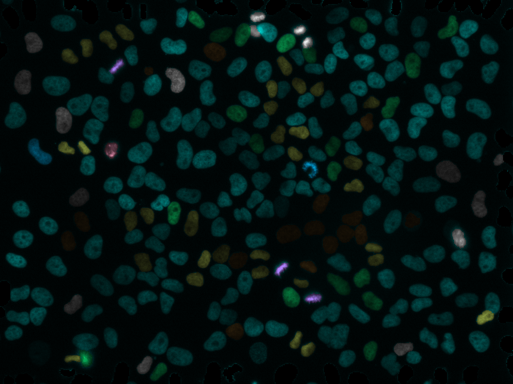
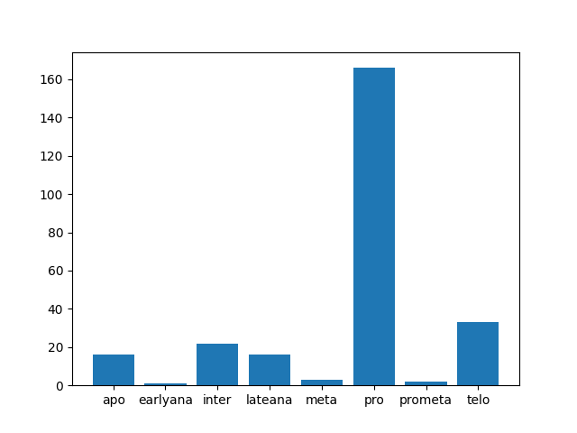

# CellPhenotype

​	This work include cell instance segmentation based on Cellpose@https://github.com/MouseLand/cellpose, using CNN to classification cell's phenotype during mitosis period.

## Overview

This project mainly consist by:

 -	Segmentation part ( using cellpose model )
 -	Classification part (including classification model's construction & training )
 -	Processing part (including a complete inference and plot )

## Segmentation 

We using cellpose to segment cell image. Note the code in the cellpose folder is **not** as same as original cellpose project. The model weight is directly download from original cellpose project.

## Classification

For the classification part, we implement and train a CNN to classification the phenotype of cell. The model archtecture and training procedure can be found in the [clsmodel.py](./clsmodel.py) ,  training data can be found in the [==cell cognition==](https://www.cellcognition-project.org/demo_data.html) website. 

In this project, we use H2b_aTub_MD20x_exp911 dataset, H2B annotation, approx 1000 pictures. We treat them as follows:

- iterate each sample, find them in the original experiment image.
- crop 64*64 picture on each sample's center
- apply Contrast Limited Adaptive Histogram Equalization 
- apply flip augmentation if needed

You can find perpared training data at ./dataset/mc64 folder.

## Tracking

## Processing

complete processing and plot can be found in test.py

